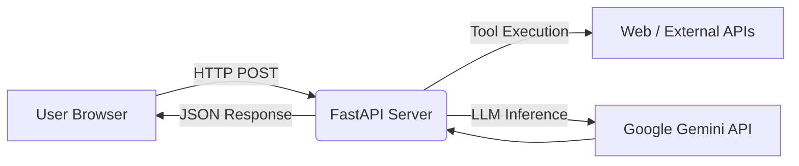

# Technical Architecture

This document provides a high-level overview of the AgentFlow system architecture, detailing how the Next.js frontend interacts with the FastAPI backend and how the AI agent processes and executes commands.

## System Overview

The application is built on a decoupled Client-Server architecture:
1. **Client (Frontend)**: Next.js App Router providing a reactive, client-side rendered UI with local storage state management.
2. **Server (Backend)**: FastAPI application providing REST endpoints and housing the Agentic execution logic.

## Frontend Architecture

The frontend is located in the `frontend/` directory and relies on React's `useState` and `useEffect` for state management, bypassing heavy state management libraries like Redux for speed and simplicity.

### State Management & Sessions
- **Session Persistence**: All chat history is serialized and stored in the browser's `localStorage` under the key `agentflow_sessions`.
- **Hydration Strategy**: On component mount, a `useEffect` hook reads `localStorage` and hydrates the `sessions` state array, mitigating React hydration mismatch errors.
- **Optimistic UI**: When a user sends a message, it is immediately appended to the active session state before the API request is made, ensuring zero perceived latency for the user input.

### The Nebula UI System
The visual identity relies heavily on Tailwind CSS.
- **Glassmorphism**: Handled via custom `.glass-panel` utilities in `globals.css`.
- **Responsive Layout**: Sidebar visibility is managed via the `sidebarOpen` state, defaulting to false on mobile viewports.

## Backend Architecture

The backend is located in the `backend/` directory. It uses FastAPI for high-performance async request handling.

### Routing & CORS
- **`main.py`**: The entry point. Configures `CORSMiddleware` to strictly allow origins from `localhost:3000` and the defined production Vercel domain.
- **`/api/health`**: A lightweight endpoint to verify server uptime.
- **`/api/agent/chat`**: The primary endpoint. Receives the user's message and the conversation history array.

### Agent Execution Loop
The core intelligence resides in `services/agent_executor.py`. AgentFlow implements a ReAct (Reasoning and Acting) loop:

1. **Prompt Construction**: The user's query and history are packaged with a system prompt detailing available tools (e.g., `web_search`).
2. **Model Inference**: The Gemini 1.5 model is invoked. It is allowed to return either a direct text response OR a JSON structured tool call.
3. **Tool Execution**: If a tool is called, the backend executes the corresponding python function (e.g., scraping DuckDuckGo).
4. **Observation Synthesis**: The tool's output is fed *back* to the model as an observation.
5. **Finalization**: The model synthesizes the observation into a final, human-readable markdown response.

### Extensibility
Adding new tools to the Agent requires only two steps:
1. Define the Python function in `tools.py`.
2. Register the tool signature in the system prompt inside `agent_executor.py`. The LLM will automatically learn when and how to invoke it.
